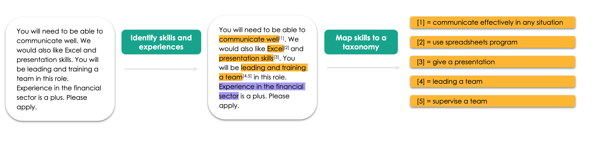

# Skills Extractor

- [Installation](#installation)
- [Using Nesta's Skills Extractor library](#usage)
- [Development](#development)

## Welcome to Nesta's Skills Extractor Library

Welcome to the documentation of Nesta's skills extractor library.

This page contains information on how to install and use Nesta's skills extraction library. The skills library allows you to extract skills phrases from job advertisement texts and maps them onto a skills taxonomy of your choice.



We currently support three different taxonomies to map onto: the [European Commission’s European Skills, Competences, and Occupations (ESCO)](https://esco.ec.europa.eu/en/about-esco/what-esco), [Lightcast’s Open Skills](https://skills.lightcast.io/) and a “toy” taxonomy developed internally for the purpose of testing.

If you'd like to learn more about the models used in the library, please refer to the [model card page](https://nestauk.github.io/ojd_daps_skills/build/html/model_card.html).

## Installation <a name="installation"></a>

You can use pip to install the library:

```
pip install ojd-daps-skills
```

You will also need to download [spaCy's](https://spacy.io/models/en) `en_core_web_sm` model:

```
python -m spacy download en_core_web_sm
```

### AWS CLI

When the package is first used it will automatically download a folder of neccessary data and models. This file is ~ 1GB. Although you don't need to have AWS credentials for this to work, you will need to download the [AWS CLI](https://docs.aws.amazon.com/cli/latest/userguide/getting-started-install.html).

## TL;DR: Using Nesta's Skills Extractor library <a name="usage"></a>

The library supports three key skills extraction functionalities :

1. Extract AND map skills to a taxonomy of your choice;
2. Extract skills from job adverts;
3. Map a list of skills to a taxonomy of your choice.

The option `local=False` can only be used by those with access to Nesta's S3 bucket.

#### 1. Extract AND map skills

If you would like to extract AND map skills in one step, you are able to do so with the `extract_skills` method.

```
from ojd_daps_skills.pipeline.extract_skills.extract_skills import ExtractSkills #import the module

es = ExtractSkills(config_name="extract_skills_toy", local=True) #instantiate with toy taxonomy configuration file

es.load() #load necessary models

job_adverts = [
    "The job involves communication skills and maths skills",
    "The job involves Excel skills. You will also need good presentation skills"
] #toy job advert examples

job_skills_matched = es.extract_skills(job_adverts) #match and extract skills to toy taxonomy
```

The outputs are as follows:

```
job_skills_matched
>>> [{'SKILL': [('communication skills', ('communication, collaboration and creativity', 'S1')), ('maths skills', ('working with computers', 'S5'))]}, {'SKILL': [('Excel skills', ('working with computers', 'S5')), ('presentation skills', ('communication, collaboration and creativity', 'S1'))]}]
```

#### 2. Extract skills

You can simply extract skills from a job advert or list of job adverts:

```
from ojd_daps_skills.pipeline.extract_skills.extract_skills import ExtractSkills #import the module

es = ExtractSkills(config_name="extract_skills_toy", local=True) #instantiate with toy taxonomy configuration file

es.load() #load necessary models

job_adverts = [
    "The job involves communication skills and maths skills",
    "The job involves Excel skills. You will also need good presentation skills"
] #toy job advert examples

predicted_skills = es.get_skills(job_adverts) #extract skills from list of job adverts
```

The outputs are as follows:

```
predicted_skills
[{'EXPERIENCE': [], 'SKILL': ['communication skills', 'maths skills'], 'MULTISKILL': []}, {'EXPERIENCE': [], 'SKILL': ['Excel skills', 'presentation skills'], 'MULTISKILL': []}]

```

#### 3. Map skills

You can map either the `predicted_skills` output from `get_stills` or simply map a list of skills to a taxonomy of your choice. In this instance, we map a list of skills:

```
from ojd_daps_skills.pipeline.extract_skills.extract_skills import ExtractSkills #import the module

es = ExtractSkills(config_name="extract_skills_toy", local=True) #instantiate with toy taxonomy configuration file

es.load() #load necessary models

skills_list = [
    "Communication",
    "Excel skills",
    "working with computers"
] #list of skills (and/or multiskills) to be matched

skills_list_matched = es.map_skills(skills_list) #match formatted skills to toy taxonomy
```

The outputs are as follows:

```
skills_list_matched
>>> [{'SKILL': [('Excel skills', ('working with computers', 'S5')), ('Communication', ('use communication techniques', 'cdef')), ('working with computers', ('communication, collaboration and creativity', 'S1'))]}]
```

## App

If you would like to demo the library using a front end, we have also [built a streamlit app](http://18.169.52.145:8501/) that allows you to extract skills for a given text. The app allows you to paste a job advert of your choice, extract and map skills onto any of the configurations: `extract_skills_toy`, `extract_skills_lightcast` and `extract_skills_esco`.


## Development <a name="development"></a>

If you'd like to modify or develop the source code you can clone it by first running:

```
git clone git@github.com:nestauk/ojd_daps_skills.git
```

### Setup

- Meet the data science cookiecutter [requirements](http://nestauk.github.io/ds-cookiecutter/quickstart), in brief:
  - Install: `direnv` and `conda`
- Create a blank cookiecutter conda log file:
  - `mkdir .cookiecutter/state`
  - `touch .cookiecutter/state/conda-create.log`
- Run `make install` to configure the development environment
- Download spacy model:
  - `python -m spacy download en_core_web_sm`

If you don't have the AWS CLI installed - you can download a zipped folder of the data [by clicking here](https://open-jobs-indicators.s3.eu-west-1.amazonaws.com/escoe_extension/ojd_daps_skills_data.zip). After downloading and unzipping, it is important that this folder is moved to the project's parent folder - i.e. `ojd_daps_skills/`.

### Project structure

The project is split into three core pipeline folders:

- [skill_ner](https://github.com/nestauk/ojd_daps_skills/tree/dev/ojd_daps_skills/pipeline/skill_ner) - Training a Named Entity Recognition (NER) model to extract skills from job adverts.
- [skill_ner_mapping](https://github.com/nestauk/ojd_daps_skills/tree/dev/ojd_daps_skills/pipeline/skill_ner_mapping) - Matching skills to an existing skills taxonomy using semantic similarity.
- [extract_skills](https://github.com/nestauk/ojd_daps_skills/tree/dev/ojd_daps_skills/pipeline/extract_skills) - User friendly functionality to extract and map skills from job adverts.

Much more about these steps can be found in each of the pipeline folder READMEs.


_An example of extracting skills and mapping them to the ESCO taxonomy._

### Testing

Some functions have tests, these can be checked by running

```
pytest
```

### Analysis

Various pieces of analysis are done in the [analysis folder](https://github.com/nestauk/ojd_daps_skills/tree/dev/ojd_daps_skills/analysis/). These require access to various datasets from Nesta's private S3 bucket and are therefore only designed for internal Nesta use.

### Contributor guidelines

The technical and working style guidelines can be found [here](https://github.com/nestauk/ds-cookiecutter/blob/master/GUIDELINES.md).

---

<small><p>This project was made possible via funding from the <a target="_blank" href="https://www.escoe.ac.uk/">Economic Statistics Centre of Excellence</a></p></small>

<small><p>Project template is based on <a target="_blank" href="https://github.com/nestauk/ds-cookiecutter">Nesta's data science project template</a>
(<a href="http://nestauk.github.io/ds-cookiecutter">Read the docs here</a>).
</small>
