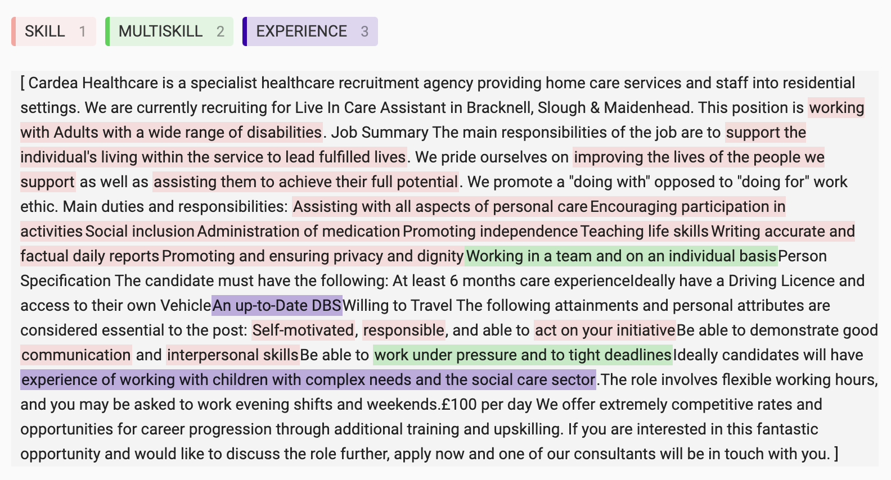
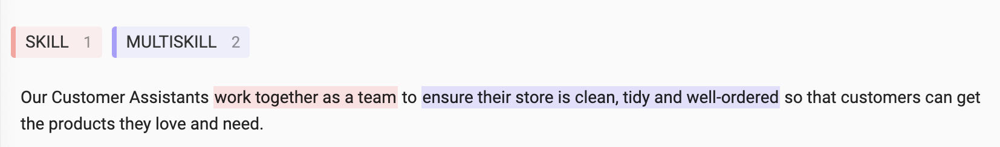

# Entity Labelling

[June 2024 update: The training of the models used in the skills extraction algorithm is now done using code from the [ojd_daps_language_models](https://github.com/nestauk/ojd_daps_language_models/blob/dev/skillner/README.md) Github repo. Read more up to date information about the process and metrics there.]

To extract skills from job adverts we took an approach of training a named entity recognition (NER) model to predict which parts of job adverts were skills ("skill entities"), which were experiences ("experience entities") and which were job benefits ("benefit entities").

To train the NER model we needed labelled data. First we created a random sample of job adverts and got them into a form needed for labelling using [Label Studio](https://labelstud.io/) and also [Prodigy](https://prodi.gy/).

There are 4 entity labels in our training data:

1. `SKILL`
2. `MULTISKILL`
3. `EXPERIENCE`
4. `BENEFIT`

The user interface for the labelling task in label-studio looks like:

We tried our best to label from the start to end of each individual skill, starting at the verb (if given):

Sometimes it wasn't easy to label individual skills, for example an earlier part of the sentence might be needed to define the later part. An example of this is "Working in a team and on an individual basis" - we could label "Working in a team" as a single skill, but "on an individual basis" makes no sense without the "Working" word. In these situations we labelled the whole span as multi skills:

Sometimes there were no entities to label:

`EXPERIENCE` labels will often be followed by the word "experience" e.g. "insurance experience", and we included some qualifications as experience, e.g. "Electrical qualifications".

### Training dataset

For the current NER model (20230808), 8971 entities in 500 job adverts from our dataset of job adverts were labelled; 443 are multiskill, 7313 are skill, 852 were experience entities, and 363 were benefit entities. 20% of the labelled entities were held out as a test set to evaluate the models.
