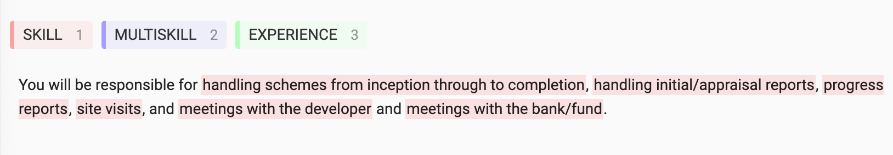
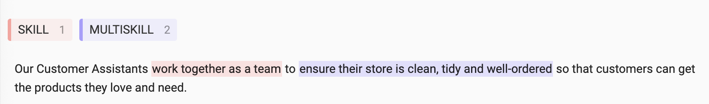

# Skill NER

## Label data

### Creating a sample of the OJO data

We first create a sample of job adverts to label.

First, connected to the Nesta VPN and in your activated conda environment, export your SQL credentials location to an environmental variable:

```
export SQL_DB_CREDS="$HOME/path/to/mysqldb_team_ojo_may22.config"
```

Then run the script with:

```
python ojd_daps_skills/pipeline/skill_ner/create_data_sample.py --sample_size 5000
```

The random sample of job adverts created from this will be stored in S3 in the `open-jobs-lake` bucket in the `/escoe_extension/inputs/data/skill_ner/data_sample/` folder.

### Processing the job adverts

After creating this random sample we process it into a form suitable for labelling in label-studio.

Back to this `ojd_daps_skills` repo and conda environment, this processing is done by running:

```
python ojd_daps_skills/pipeline/skill_ner/create_label_data.py
```

An output file which can be inputted into label-studio (the descriptions from the job advert sample) is stored in `s3://open-jobs-lake/escoe_extension/inputs/data/skill_ner/20220623_sample_labelling_text_data.txt`, and a sister file which maps the job advert text to the job ID of the advert they were in is stored in `s3://open-jobs-lake/escoe_extension/inputs/data/skill_ner/20220623_sample_labelling_metadata.json`. This latter file is important for any analysis of the sample data since we can link back to the job advert's metadata, so could analysis which years/job occupations the sample came from.

### Labelling

There are 3 labels:

1. SKILL
2. MULTISKILL
3. EXPERIENCE

- Label all the skills by dragging from the start of where the skill is mentioned to the end, then press `SUBMIT`.
  
- If there are no skills in the sentence press `SUBMIT`.
  
- Try to label each skill separately with a `SKILL` label, but if this isn't possible use the `MULTISKILL` tag.
  
- `EXPERIENCE` labels will often be followed by "experience" e.g. "insurance experience".
- `EXPERIENCE` labels also include qualifications, e.g. "Electrical qualifications".
- If its just "have a degree" then this shouldn't be labelled, but if it is "have a maths degree" then "maths" can be labelled as a `SKILL`
- `MULTISKILL` labels will often be when you need an earlier part of the sentence to define the later part
- When labelling spans try to start at the verb

When to `SKIP`:

- Anything which is too hard to label where you think you'll make bad mistakes then `SKIP`
- If you aren't sure then `SKIP`.
- If the text is badly formatted to the extent its hard to label then `SKIP`
  

We don't want bad labels in our training data

Be careful:

- To include the whole span of the skill(s). Try not to make sure you havent cut any characters off or added any.
- Try to to include trailing whitespace in the spans

#### label-studio options

- Random sampling
- SKILL, MULTISKILL, EXPERIENCE label
- "Select text by words" selected
- "Add filter for long list of labels" NOT selected

### Files used

For the labelling done at the end of June 2022, we labelled the chunk of 400 job adverts stored here `s3://open-jobs-lake/escoe_extension/outputs/data/skill_ner/label_chunks/20220624_0_sample_labelling_text_data.txt`, which the job advert IDs in the `20220624_0_sample_labelling_metadata.json` file.

The outputs of this labelled are stored in `s3://open-jobs-lake/escoe_extension/outputs/skill_span_labels/`.

### Merging labelled files

Since multiple people labelled files from different locations, we merge the labelled data using the following command:

```
python ojd_daps_skills/pipeline/skill_ner/combine_labels.py
```

This creates `escoe_extension/outputs/labelled_job_adverts/combined_labels_{DATE_STAMP}.json` which contains the combine data needed to train the NER model.

## Training a NER model

Using the combined labelled data, we can fine-tune a Spacy model to extract skill entities from job adverts.

The model can be trained by running:

```
python ojd_daps_skills/pipeline/skill_ner/ner_spacy.py --labelled_date_filename "escoe_extension/outputs/labelled_job_adverts/combined_labels_20220824.json" --convert_multiskill --train_prop 0.8 --drop_out 0.1 --learn_rate 0.001 --num_its 100
```

This will save out the model in a time stamped folder, e.g. `outputs/models/ner_model/20220825/`, it also saves out the evaluation results and some general information about the model training in the file `outputs/models/ner_model/20220825/train_details.json`.

By default this won't sync the newly trained model to S3, but by adding `--save_s3` it will sync the `outputs/models/ner_model/20220825/` to S3.

This model can be used by running:

```python
>>> from ojd_daps_skills.pipeline.skill_ner.ner_spacy import JobNER
>>> job_ner = JobNER()
>>> nlp = job_ner.load_model('outputs/models/ner_model/20220825/', s3_download=True)
>>> text = "We want someone with good communication and maths skills"
>>> pred_ents = job_ner.predict(text)
>>> pred_ents
[{'label': 'SKILL', 'start': 21, 'end': 39}, {'label': 'SKILL', 'start': 44, 'end': 56}]
>>> for ent in pred_ents:
>>>     print(text[ent['start']:ent['end']])
good communication
maths skills
```

The `s3_download=True` argument will mean this model will be first downloaded from S3, so you don't have to have it locally to begin with.

## Using the model to make predictions on lots of job adverts

Running

```
python ojd_daps_skills/pipeline/skill_ner/get_skills.py --model_path outputs/models/ner_model/20220825/ --output_file_dir escoe_extension/outputs/data/skill_ner/skill_predictions/ --job_adverts_filename escoe_extension/inputs/data/skill_ner/data_sample/20220622_sampled_job_ads.json
```

will make skill predictions on the data in `job_adverts_filename` (an output of `create_data_sample.py`) using the model loaded from `model_path`. By default this will look for the model on S3, but if you want to load a locally stored model just add `--use_local_model`.

The output will contain a dictionary of predictions, where each key is the job advert ID, including a flag for whether this job advert was used in the training of the model or not.
