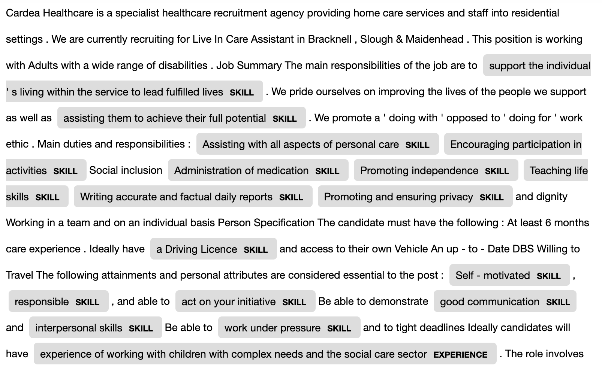
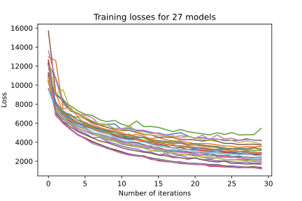
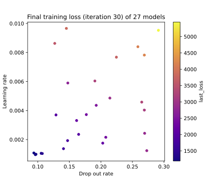
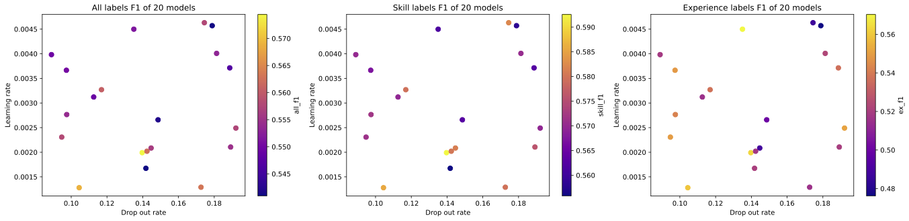
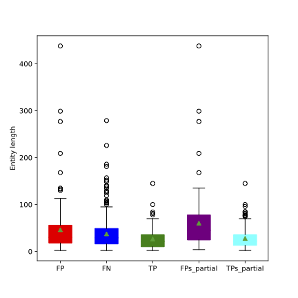
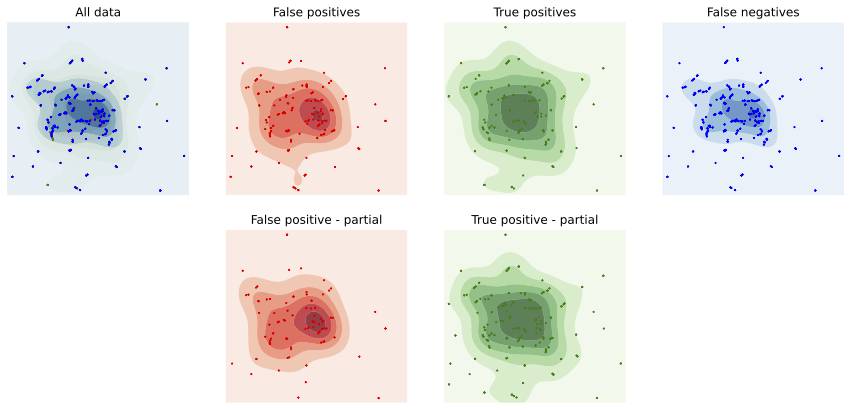

# Skills Extraction Methodology

This document outlines the methodology for extracting skills from job adverts and making sense of them.

Information on commands needed to run scripts in this repo and S3 locations of outputs are given in pipeline READMEs rather than here, but we will link to all relevant documents.

## Overview

To extract skills from job adverts we took an approach of training a named entity recognition (NER) model to predict which parts of job adverts were skills ("skill entities") and which were experiences ("experience entities").

After extracting skills and experience entities we matched these, where possible, to an existing taxonomy. Our go-to example for this in the [ESCO](https://esco.ec.europa.eu/en) skills taxonomy, but our code is broad enough to support different input taxonomies.

This process means we can extract skills from thousands of job adverts and analyse how these skills differ regionally.

## Labelling data

To train the NER model we needed labelled data. First we created a random sample of job adverts and got them into a form needed for labelling using [Label Studio](https://labelstud.io/). More about this labelling process can be found in the `skill_ner` pipeline [README.md](./ojd_daps_skills/ojd_daps_skills/pipeline/skill_ner/README.md).

As of 11th July 2022 we have labelled 3400 entities; 404 (12%) are multiskill, 2603 (77%) are skill, and 393 (12%) are experience entities.

### Multiskill labels

Sometimes it was hard to distinctly label each skill mentioned, for example when the whole sentence is needed to make sense of the individual skills mentioned.

An example of this is "Working in a team and on an individual basis" - we could label "Working in a team" as a single skill, but "on an individual basis" makes no sense without the "Working" word.

### Labelling comparison analysis

Four members of the team labelled job adverts, so to get a sense of how consistent we were about labelled we all labelled the same 10 job adverts.

**Add analysis of this**

## Skill NER

We then trained a NER model using this labelled data. More about the details of the scripts for this training can be found in the `skill_ner` pipeline [README.md](./ojd_daps_skills/ojd_daps_skills/pipeline/skill_ner/README.md).

For this, we used [Spacy's](https://spacy.io/) NER neural network architecture. Their NER architecture _"features a sophisticated word embedding strategy using subword features and 'Bloom' embeddings, a deep convolutional neural network with residual connections, and a novel transition-based approach to named entity parsing"_ - more about this [here](https://spacy.io/universe/project/video-spacys-ner-model).

### Multiskill classifier

During the training of the NER model we also train a very basic SVM classifier to predict whether a skill entity contains a single skill or multiple skills. We use the same test/train split for this as for the NER model.

Thus, when we predict the entities for a job advert, any skill entities predicted are also classified as being a SKILL (single skill) or MULTISKILL.

### Experiments

When `Convert multiskill?` is True, the model doesn't differentiate between "multiskill" and "skill" entities. This is the default.

Our evaluation scores use the [nervaluate](https://pypi.org/project/nervaluate/) package. We are happy for the model to find similar but not exact span matches, e.g. finding "Excel" rather than the labelled "Excel skills". This is because it is hard for even human labellers to agree on where a skill entity starts and ends. Thus, we use the 'partial' metric - this is a _"partial boundary match over the surface string, regardless of the type"_. Even so, we find that this metric is still very strict, and on inspection some of the false positives should arguably be true positives.

A summary of the experiments with training the model is below.

| Date (model name) | Base model     | Training size   | Evaluation size | Number of iterations | Drop out rate | Learning rate | Convert multiskill? | Other info                                                                                       | Skill F1 | Experience F1 | All F1 | Multiskill test score |
| ----------------- | -------------- | --------------- | --------------- | -------------------- | ------------- | ------------- | ------------------- | ------------------------------------------------------------------------------------------------ | -------- | ------------- | ------ | --------------------- |
| 20220825          | blank en       | 300 (4508 ents) | 75 (1133 ents)  | 100                  | 0.1           | 0.001         | True                | Changed hyperparams, more data                                                                   | 0.59     | 0.51          | 0.56   | 0.91                  |
| 20220729\*        | blank en       | 196 (2850 ents) | 49 (636 ents)   | 50                   | 0.3           | 0.001         | True                | More data, padding in cleaning but do fix_entity_annotations after fix_all_formatting to sort it | 0.57     | 0.44          | 0.54   | 0.87                  |
| 20220729_nopad    | blank en       | 196             | 49              | 50                   | 0.3           | 0.001         | True                | No padding in cleaning, more data                                                                | 0.52     | 0.33          | 0.45   | 0.87                  |
| 20220714          | blank en       | 182             | 46              | 50                   | 0.3           | 0.001         | True                | Camel case cleaned, multiskill classifier added and labelled data cleaned                        | 0.55     | 0.42          | 0.54   | 0.85                  |
| 20220705          | en_core_web_sm | 182             | 45              | 50                   | 0.3           | 0.001         | True                | Camel case cleaned                                                                               | 0.52     | 0.48          | 0.52   |                       |
| 20220704          | blank en       | 182             | 45              | 50                   | 0.3           | 0.001         | True                | Camel case cleaned                                                                               | 0.54     | 0.39          | 0.52   |                       |
| 20220630          | blank en       | 180             | 45              | 50                   | 0.3           | 0.001         | True                |                                                                                                  | 0.49     | 0.39          | 0.48   |                       |
| 20220629          | blank en       | 156             | 39              | 50                   | 0.3           | 0.001         | True                |                                                                                                  | 0.52     | 0.45          | 0.51   |                       |

More in-depth metrics for `20220825`:

| Entity     | F1    | Precision | Recall |
| ---------- | ----- | --------- | ------ |
| Skill      | 0.586 | 0.679     | 0.515  |
| Experience | 0.507 | 0.648     | 0.416  |
| All        | 0.563 | 0.644     | 0.501  |

More in-depth metrics for `20220729`:

| Entity     | F1    | Precision | Recall |
| ---------- | ----- | --------- | ------ |
| Skill      | 0.566 | 0.616     | 0.523  |
| Experience | 0.437 | 0.447     | 0.428  |
| All        | 0.543 | 0.577     | 0.512  |

More in-depth metrics for `20220729_nopad`:

| Entity     | F1    | Precision | Recall |
| ---------- | ----- | --------- | ------ |
| Skill      | 0.519 | 0.587     | 0.465  |
| Experience | 0.330 | 0.430     | 0.268  |
| All        | 0.500 | 0.562     | 0.450  |

Not padding punctuation seems to make things worse, even though it means getting rid of some of the training and test data entities. I wonder why?

More in-depth metrics for `20220704`:

| Entity     | F1    | Precision | Recall |
| ---------- | ----- | --------- | ------ |
| Skill      | 0.543 | 0.715     | 0.437  |
| Experience | 0.385 | 0.467     | 0.328  |
| All        | 0.524 | 0.684     | 0.425  |

More in-depth metrics for `20220714`:

| Entity     | F1    | Precision | Recall |
| ---------- | ----- | --------- | ------ |
| Skill      | 0.551 | 0.617     | 0.498  |
| Multiskill | 0.570 | 0.565     | 0.575  |
| Experience | 0.424 | 0.568     | 0.338  |
| All        | 0.540 | 0.608     | 0.486  |

\* For model `20220714` we relabelled the MULTISKILL labels in the dataset - we were trying to see whether some of them should actually be single skills, or could be separated into single skills rather than (as we found) labelling a large span as a multiskill. This process increased our number of labelled skill entities (from 2603 to 2887) and decreased the number of multiskill entities (from 404 to 218), resulting in a net increase in entities labelled (from 3400 to 3498).

### Parameter tuning

For model `20220825` onwards we changed our hyperparameters after some additional experimentation revealed improvements could be made. This experimentation was on a dataset of 375 job adverts in total.

We varied the learning rate and the drop out rate randomly and then looked at the loss after 30 iterations. For this we found that low drop out and learning rates gave lower losses, and we were confirmed in thinking that by 50 iterations the reduction in loss will have stabilised (since after 30 iterations it appears to).

Our experimentation lead us to choose a learning rate of 0.001 and drop out rate of 0.1.

We found that the test metric result didn't have much influence from these parameters.

### Error analysis

Using our hold-out test set of 45 job adverts we were able to do some error analysis. The following results are from the `20220704` model.

For this analysis we mixed skills and experience entities. We labelled a total number of 533 entities in these 45 job adverts (the 'gold standard' entities), and when the model was applied it predicted 321 entities.

A simple exact text match across all entities no matter which job advert they were in revealed:

- 155 entities were in both the predicted and gold standard
- 166 were in the predicted, but not in the gold standard
- 378 were in the gold standard, but not the actual

We also looked within each job advert to compare which entities were in the gold standard set and which were in the predicted set. This showed:

- 180 entities were in the predicted but not the gold set (FPs)
- 401 entities were in the gold but not the predicted sets (FNs)
- 174 entities were in both the gold and predicted sets (TPs)
- 98 entities were in the predicted but not the gold set with a partial match. This is where the predicted string does not sit within any gold string, e.g. "pro communication" is not in "communication skills" (FPs partial)
- 256 entities were in both the predicted and gold sets with a partial match. This is where the predicted entity string sits within a gold string, e.g. "communication" is in "communication skills (TPs partial).

We can look at how these different sets differ in the number of characters in the entity with the averages and box plots given below. We see the model does best when the entity is short (the TPs are the shortest), and longer entities are harder to predict correctly.

- FPs: 46
- FNs: 38
- TPs: 27
- FPs_partial: 60
- TPs_partial: 28

We also analysed the semantic spaces of the different sets of entities. From the contour spaces these look quite similar no matter whether the entity was a FP, TP or FN. To do this we embedded the entities using the `sentence-transformers/all-MiniLM-L6-v2` transformers pre-trained model, then reduced the embeddings to 2D using UMAP.

## Evaluation - comparison to other taxonomies

## Matching to other taxonomies

